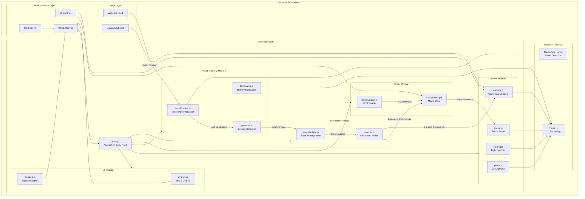
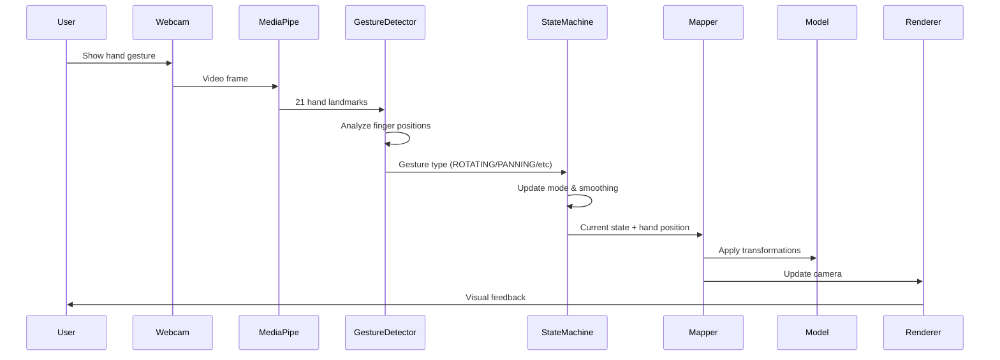
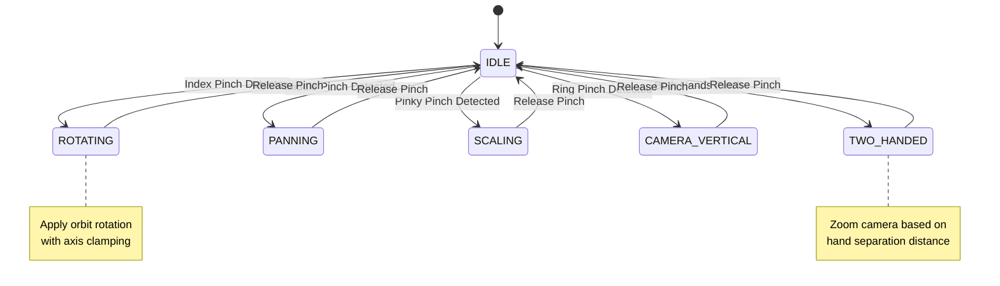
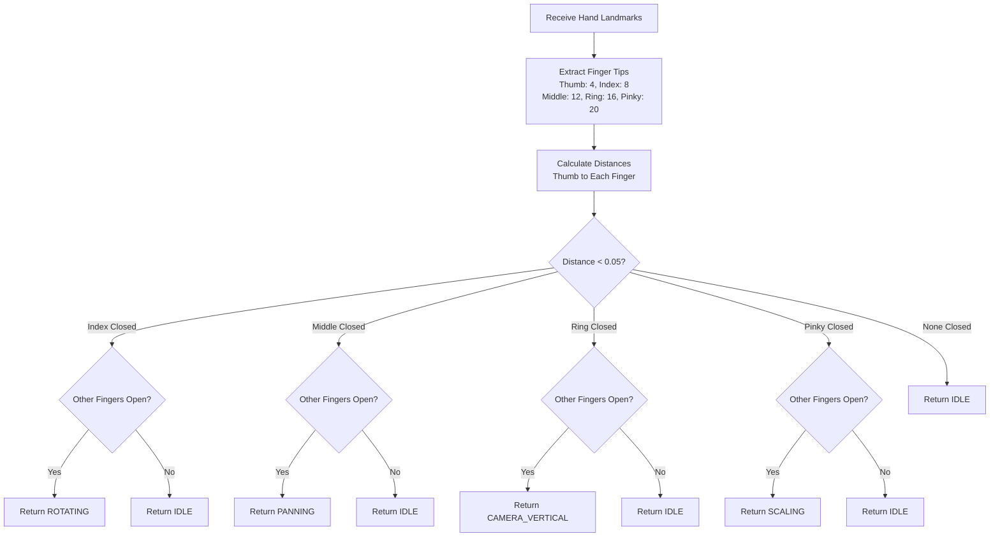

# HandSpace Technical Architecture

## Overview
HandSpace is a browser-based 3D model manipulation system that uses computer vision for hand tracking and gesture recognition. The architecture follows a modular design pattern with clear separation of concerns.

---

## System Architecture

---

## Data Flow

---

## Module Breakdown

### 1. Scene Module (`src/scene/`)
**Responsibility**: Three.js environment setup

- **scene.js**: Creates WebGL renderer and scene object
- **camera.js**: Configures perspective camera and orbit controls
- **lighting.js**: Sets up ambient, hemisphere, and directional lights
- **plane.js**: Creates ground grid for spatial reference

### 2. Hand Tracking Module (`src/hand/`)
**Responsibility**: Hand detection and gesture recognition

- **handTracker.js**: Initializes MediaPipe Hands with webcam
- **gestures.js**: Detects pinch gestures (index, middle, ring, pinky)
- **landmarks.js**: Visualizes hand skeleton in 3D space

**Key Algorithm**: Pinch detection using Euclidean distance between thumb and finger tips

### 3. Model Module (`src/models/`)
**Responsibility**: 3D model loading and management

- **modelLoader.js**: 
  - Loads GLTF/GLB files
  - Centers and scales models automatically
  - Manages model lifecycle (load, reset, cleanup)

### 4. Interaction Module (`src/interaction/`)
**Responsibility**: Gesture-to-action mapping

- **stateMachine.js**: 
  - Manages interaction modes (IDLE, ROTATING, PANNING, SCALING, CAMERA_VERTICAL, TWO_HANDED)
  - Applies smoothing and deadzone filtering
  - Tracks hand position deltas

- **mapper.js**: 
  - Maps gestures to model transformations
  - Handles rotation clamping
  - Controls camera movements

### 5. UI Module (`src/ui/`)
**Responsibility**: User interface controls

- **overlay.js**: Status text updates
- **controls.js**: Button event handlers for scale/reset/model selection

---

## State Machine

---

## Technology Stack

| Layer | Technology | Purpose |
|-------|-----------|---------|
| **3D Rendering** | Three.js | WebGL abstraction, scene graph, camera controls |
| **Hand Tracking** | MediaPipe Hands | Real-time hand landmark detection (21 points) |
| **Model Format** | GLTF/GLB | 3D model interchange format |
| **Language** | Vanilla JavaScript (ES6+) | No framework dependencies |
| **Module System** | ES Modules | Native browser imports |

---

## Performance Considerations

### Optimization Strategies

1. **Hand Tracking**
   - Runs at 30 FPS (MediaPipe default)
   - Landmark smoothing reduces jitter
   - Deadzone filtering prevents micro-movements

2. **Rendering**
   - RequestAnimationFrame for smooth 60 FPS
   - Shadow maps limited to 1024x1024
   - Orbit controls use damping for smooth camera movement

3. **Memory Management**
   - Model cleanup on load (geometry/material disposal)
   - Pooled hand visualization meshes (reused across frames)
   - Single scene graph with minimal object creation

---

## Gesture Detection Algorithm

---

## Coordinate Systems

### MediaPipe Hand Landmarks
- **Origin**: Top-left corner of video frame
- **Range**: Normalized [0, 1] for x, y coordinates
- **Z-depth**: Relative depth from camera

### Three.js World Space
- **Origin**: Scene center (0, 0, 0)
- **Y-axis**: Up
- **Units**: Arbitrary (models auto-scaled to fit)

### Transformation Pipeline
1. MediaPipe landmarks (normalized screen space)
2. Convert to camera-relative 3D coordinates
3. Calculate hand movement deltas
4. Apply smoothing and deadzone filtering
5. Map to model/camera transformations

---

## Future Enhancements

- [ ] Multi-model support (load multiple objects simultaneously)
- [ ] Gesture recording and playback
- [ ] VR/AR mode support
- [ ] Touch screen fallback controls
- [ ] Performance profiling dashboard
- [ ] Gesture customization interface
